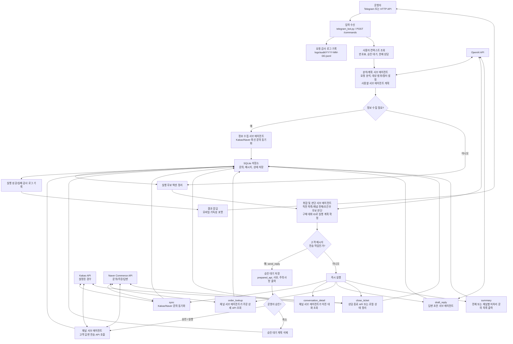

# Shopping CS Assistant

카카오톡 비즈니스 채널, 네이버 스마트스토어 고객 문의, Telegram 운영자 채팅을 묶어 관리하는 CS 보조 에이전트입니다.

운영자는 Telegram 또는 HTTP API로 자연어 요청을 보내고, 메인 에이전트가 필요한 API 호출 계획을 만든 뒤 실행합니다. 고객에게 실제 답변을 보내는 작업만 운영자 승인을 요구하며, 조회/동기화/초안 생성/주문 조회 같은 작업은 바로 실행됩니다.

## 주요 기능

- macOS, Linux, Windows PowerShell에서 실행 가능
- Telegram Bot long polling 지원
- HTTP `/commands` API로 로컬 테스트 가능
- 분석/계획 서브 에이전트가 자연어 요청을 실행 계획과 대상 선택 조건으로 변환
- 정보 수집 서브 에이전트가 필요한 채널 최신화 단계를 선행 배치
- 취합 및 판단 서브 에이전트가 직전 목록/채널 전체/조건부 문의 대상을 확정
- 채널별 서브 에이전트가 동기화, 답변 초안, 전송, 상담 종료 처리
- 답변 초안 전용 서브 에이전트가 이전 대화 전체를 기반으로 초안 생성
- 다건 문의에 대한 조건부 답변 초안 생성 지원
- 문의 상세 또는 초안 요청 시 해당 문의의 이전 대화 기록 전체 출력
- 주문내역 조회 시 고객 주문 내역, 옵션, 수량, 주문번호, 주문 상태 출력
- 고객에게 특정 메시지를 보내는 `send_reply` 작업만 승인 필요
- 사용자의 요청, 실행 계획, 실행 결과를 날짜별 JSONL 감사 로그로 저장
- 날짜가 바뀌면 새 감사 로그 파일 생성
- `.gitignore`로 `.env`, 로그, DB, 가상환경 파일 제외

## 전체 서비스 파이프라인



파이프라인 핵심:

- 입력 채널은 Telegram과 HTTP API 두 가지이며, 내부에서는 동일하게 `MainAgent.handle_message()` 흐름을 사용합니다.
- 모든 사용자 요청과 실행 결과는 감사 로그에 남습니다.
- 분석/계획 서브 에이전트는 번호표, 승인 대기 상태, 현재 상담 컨텍스트를 참고해 필요한 서브 에이전트와 대상 범위를 계획합니다.
- 정보 수집 서브 에이전트는 조회/선택/초안 생성 전에 필요한 채널 동기화를 먼저 수행하도록 계획을 보강합니다.
- 취합 및 판단 서브 에이전트는 `지금 나열해준 문의`, `네이버 채널 문의`, `3mm S/L 구매건` 같은 범위/조건을 실제 대화 ID 목록으로 확정합니다.
- 답변 초안은 별도 `DraftReplyAgent`가 이전 대화 전체를 기반으로 생성합니다.
- 고객에게 실제 메시지를 보내는 `send_reply`만 승인 대기 상태로 저장됩니다.
- 주문 조회는 문의 데이터에서 상품 주문번호를 찾고, Naver 주문 상세 API를 호출한 뒤 모바일 친화 포맷으로 출력합니다.
- 실행 후 SQLite 저장소와 날짜별 감사 로그가 갱신되고, 결과가 Telegram 또는 HTTP 응답으로 반환됩니다.

가능한 요청 예시:

- `지금 나열해준 배송지연 문의건들에 대해서는 연휴로 인한 배송지연이 예상된다고 답변하는 초안 작성해 줘`
- `문의건들 중에서 3mm S, L 사이즈 구매건들에 대해서 다음주 중 입고 후 출고 처리 가능하다는 초안 작성해 줘`
- `네이버 채널 문의건들만 최신화해서 보여줘`
- `카카오 채널 문의건 전체에 배송지연 안내 답변 초안 작성해줘`

## 동작 흐름

1. 운영자가 Telegram 또는 HTTP API로 요청합니다.
2. 분석/계획 서브 에이전트가 요청을 분석해 실행 계획, 대상 범위, 대상 필터를 만듭니다.
3. 정보 수집 서브 에이전트가 최신 데이터가 필요한 작업 앞에 채널 동기화를 배치합니다.
4. 취합 및 판단 서브 에이전트가 조건에 맞는 문의를 실제 대화 ID로 확정합니다.
5. 고객에게 메시지를 보내지 않는 작업은 즉시 실행됩니다.
6. 고객에게 특정 답변을 보내는 작업은 실행 계획, 사유, 호출 예정 API를 보여준 뒤 승인 대기합니다.
7. 운영자가 `승인` 또는 `실행`이라고 답하면 고객 메시지를 전송합니다.
8. 운영자가 `취소`라고 답하면 승인 대기 중인 계획을 버립니다.
9. 직전 상담과 다른 맥락의 요청이면 현재 상담 종료 API를 자동으로 호출하도록 계획을 보강합니다.

상담 종료 API는 채널별 종료 path가 설정된 경우에만 실제 외부 API를 호출합니다. path가 비어 있으면 로컬 상태만 정리하거나 skip 결과를 반환합니다.

## 프로젝트 구조

- `app/main.py`: FastAPI 애플리케이션 진입점
- `app/api.py`: 헬스 체크, 명령 API, 채널 웹훅 API
- `app/telegram_bot.py`: Telegram Bot API long polling 워커
- `app/agents/main_agent.py`: 전체 파이프라인 오케스트레이션, 승인 플로우, 주문 조회 포맷
- `app/agents/planning_agent.py`: 자연어 요청 분석, 대상 범위/필터 및 서브 에이전트 계획
- `app/agents/information_collector_agent.py`: 최신 정보 수집을 위한 채널 동기화 단계 보강
- `app/agents/judgement_agent.py`: 조건부/다건 문의 후보 취합 및 실행 대상 판단
- `app/agents/sub_agent.py`: 채널별 CS 처리 공통 서브 에이전트
- `app/agents/draft_reply_agent.py`: 답변 초안 생성 전용 서브 에이전트
- `app/channels/kakao.py`: Kakao 채널 API 클라이언트
- `app/channels/naver_talktalk.py`: Naver Commerce API 클라이언트
- `app/storage/repository.py`: SQLite 저장소, 사용자 컨텍스트, 승인 대기 계획
- `app/audit.py`: 날짜별 감사 로그 기록
- `app/check_apis.py`: `.env` 값 기반 외부 API 연결 점검

## 지원 액션

- `sync`: Kakao/Naver 채널에서 최신 문의를 동기화
- `summary`: 채널별 미처리 문의 목록과 번호표 출력
- `conversation_detail`: 특정 문의의 이전 대화 전체 조회
- `order_lookup`: 특정 문의의 주문내역, 옵션, 수량, 주문번호, 주문 상태 조회
- `draft_reply`: 이전 대화 전체를 기반으로 답변 초안 생성
- `send_reply`: 고객에게 답변 전송, 반드시 운영자 승인 필요
- `close_ticket`: 상담 종료 처리

`draft_reply`, `send_reply`, `conversation_detail`, `order_lookup`, `close_ticket`은 단일 `conversation_id`뿐 아니라 `target_scope`와 `target_filter`를 통해 다건 대상을 지정할 수 있습니다.

- `last_listed`: 직전에 사용자에게 보여준 문의 목록에서 선택
- `channel_open`: 특정 채널의 미처리 문의 전체에서 선택
- `all_open`: 전체 채널의 미처리 문의에서 선택

## 설치

Python 3.11 이상을 사용합니다.

macOS/Linux:

```bash
python3 -m venv .venv
source .venv/bin/activate
python -m pip install -U pip
python -m pip install -e .
cp .env.example .env
```

Windows PowerShell:

```powershell
py -3.11 -m venv .venv
.\.venv\Scripts\Activate.ps1
python -m pip install -U pip
python -m pip install -e .
Copy-Item .env.example .env
```

Windows에서 `Activate.ps1` 실행이 막히면 현재 PowerShell 세션에서 아래 명령을 먼저 실행합니다.

```powershell
Set-ExecutionPolicy -Scope Process -ExecutionPolicy Bypass
```

## 환경 변수

`.env.example`을 복사해 `.env`를 만들고 필요한 값을 채웁니다. `.env`는 `.gitignore`에 포함되어 있으므로 저장소에 업로드하지 않습니다.

최소 실행에 필요한 값:

```env
OPENAI_API_KEY=sk-...
OPENAI_MODEL=gpt-4o-mini
TELEGRAM_BOT_TOKEN=123456:telegram-bot-token
AUDIT_LOG_DIR=./logs/audit
```

로컬 앱 설정:

```env
APP_ENV=local
APP_HOST=0.0.0.0
APP_PORT=8000
APP_LOG_LEVEL=INFO
SQLITE_PATH=./shopping_cs.sqlite3
AUDIT_LOG_DIR=./logs/audit
```

Telegram:

```env
TELEGRAM_BOT_TOKEN=123456:telegram-bot-token
TELEGRAM_ALLOWED_CHAT_IDS=
TELEGRAM_POLL_TIMEOUT_SECONDS=30
```

`TELEGRAM_ALLOWED_CHAT_IDS`를 비워두면 모든 chat id를 허용합니다. 운영 환경에서는 운영자 chat id만 쉼표로 구분해 넣는 것을 권장합니다.

## Kakao 설정

```env
KAKAO_API_BASE_URL=https://api.example-kakao.com
KAKAO_REST_API_KEY=your-kakao-rest-api-key
KAKAO_CHANNEL_ID=your-kakao-channel-id
KAKAO_LIST_CONVERSATIONS_PATH=
KAKAO_SEND_MESSAGE_PATH=
KAKAO_UPDATE_STATUS_PATH=
```

현재 공개 Kakao REST API에는 이 프로젝트가 기대하는 형태의 상담 목록 조회 API가 없습니다. 별도 계약, 비즈니스 센터 제휴 API, 사내 프록시 API가 없다면 아래 값은 비워두면 됩니다.

- `KAKAO_LIST_CONVERSATIONS_PATH`
- `KAKAO_SEND_MESSAGE_PATH`
- `KAKAO_UPDATE_STATUS_PATH`

비워둔 경우 `python -m app.check_apis`에서 Kakao는 다음처럼 정상 안내가 나옵니다.

```text
[OK] kakao: conversation list API is not configured; public Kakao REST API does not provide this endpoint
```

Kakao 값을 찾는 위치:

- Kakao Developers: 애플리케이션 REST API key
- Kakao 비즈니스/상담 API 계약 문서: 상담 목록, 메시지 전송, 상태 변경 endpoint
- 사내에서 제공하는 프록시가 있다면 해당 base URL과 path

## Naver 설정

Naver는 네이버 커머스 API 기준으로 동작합니다.

```env
NAVER_TALKTALK_API_BASE_URL=https://api.commerce.naver.com/external
NAVER_CLIENT_ID=your-naver-client-id
NAVER_CLIENT_SECRET=your-naver-client-secret
NAVER_TALKTALK_CHANNEL_ID=
NAVER_ACCOUNT_ID=
NAVER_TOKEN_TYPE=SELF
NAVER_OAUTH_TOKEN_PATH=/v1/oauth2/token
NAVER_LIST_CONVERSATIONS_PATH=/v1/pay-user/inquiries
NAVER_INQUIRY_SEARCH_DAYS=30
NAVER_INQUIRY_PAGE_SIZE=50
NAVER_ORDER_DETAIL_PATH=/v1/pay-order/seller/product-orders/query
NAVER_SEND_MESSAGE_PATH=/v1/pay-merchant/inquiries/{conversation_id}/answer
NAVER_UPDATE_STATUS_PATH=
```

필수 값:

- `NAVER_CLIENT_ID`: 네이버 커머스 API 센터 애플리케이션 Client ID
- `NAVER_CLIENT_SECRET`: 네이버 커머스 API 센터 애플리케이션 Client Secret
- `NAVER_TOKEN_TYPE`: 보통 판매자가 직접 만든 애플리케이션이면 `SELF`

상황에 따라 필요한 값:

- `NAVER_ACCOUNT_ID`: `NAVER_TOKEN_TYPE=SELLER`일 때만 필요합니다.
- `NAVER_TALKTALK_CHANNEL_ID`: 현재 커머스 문의 API path에는 직접 쓰지 않지만, 별도 톡톡 API 또는 프록시 path가 `{channel_id}`를 요구하면 채웁니다.
- `NAVER_UPDATE_STATUS_PATH`: 상담 종료 API endpoint를 확보한 경우에만 채웁니다. 비워두면 종료 API 호출은 skip됩니다.

기본 path:

- 토큰 발급: `/v1/oauth2/token`
- 고객 문의 조회: `/v1/pay-user/inquiries`
- 주문 상세 조회: `/v1/pay-order/seller/product-orders/query`
- 답변 등록: `/v1/pay-merchant/inquiries/{conversation_id}/answer`

문의 조회 API는 `startSearchDate`, `endSearchDate`가 필수입니다. 이 프로젝트는 `NAVER_INQUIRY_SEARCH_DAYS` 기준으로 최근 N일 범위를 자동으로 넣습니다.

Naver 값을 찾는 위치:

- 네이버 커머스 API 센터: 애플리케이션 Client ID, Client Secret
- API 센터 문서: 고객 문의 조회, 답변 등록, 상품 주문 상세 조회 endpoint
- 판매자 계정/애플리케이션 권한 화면: 문의/주문 조회 권한 승인 여부

## API 연결 점검

`.env` 값을 채운 뒤 아래 명령으로 API 연결을 점검합니다.

```bash
python -m app.check_apis
```

점검 항목:

- OpenAI: 설정한 모델 조회 가능 여부
- Telegram: Bot API `getMe` 가능 여부
- Kakao: 상담 목록 path 설정 여부 또는 목록 API 호출 가능 여부
- Naver: OAuth 토큰 발급 후 문의 목록 조회 가능 여부

예상 출력:

```text
[OK] openai: model reachable: gpt-4o-mini
[OK] telegram: bot reachable: @your_bot
[OK] kakao: conversation list API is not configured; public Kakao REST API does not provide this endpoint
[OK] naver: list conversations reachable: 3 items
```

자주 보는 오류:

- Naver `type 항목이 유효하지 않습니다`: `NAVER_TOKEN_TYPE`을 `SELF` 또는 `SELLER` 대문자로 설정합니다.
- Naver `403 Forbidden`: Client ID/Secret, 애플리케이션 권한, 판매자 계정 권한을 확인합니다.
- Naver `startSearchDate/endSearchDate null`: `NAVER_LIST_CONVERSATIONS_PATH`가 `/v1/pay-user/inquiries`인지 확인하고 최신 코드에서 실행합니다.
- Kakao `404 Not Found`: 공개 Kakao REST API에는 상담 목록 endpoint가 없으므로, 별도 계약 endpoint가 없다면 Kakao path를 비워둡니다.

`check_apis`는 read-only 성격의 확인만 수행합니다. 고객 메시지 전송이나 상담 종료 같은 변경 작업은 실행하지 않습니다.

## 서버 실행

터미널 1에서 FastAPI 서버를 실행합니다.

```bash
uvicorn app.main:app --host 0.0.0.0 --port 8000
```

헬스 체크:

```bash
curl http://localhost:8000/health
```

응답:

```json
{"status":"ok"}
```

터미널 2에서 Telegram 워커를 실행합니다.

```bash
python -m app.telegram_bot
```

코드를 수정한 뒤에는 Telegram 워커를 재시작해야 변경 사항이 반영됩니다.

## Telegram 사용 예시

미처리 문의 목록:

```text
각 채널별로 미처리 문의 내역 정리해서 보여줘
```

최신 동기화 후 목록 확인:

```text
네이버 미처리 문의건 확인해줘
```

특정 문의 상세 확인:

```text
네이버 1번 문의 내용 알려줘
```

이전 대화 기반 답변 초안:

```text
네이버 1번 문의에 대해 교환 가능 여부 답변 초안 만들어줘
```

주문내역 조회:

```text
각 문의건들 주문내역 조회해줘
```

고객에게 답변 전송 요청:

```text
네이버 1번 고객에게 "안녕하세요. 교환 접수 가능하며 접수 방법 안내드리겠습니다."라고 보내줘
```

위 요청은 바로 전송되지 않고 승인 대기 상태가 됩니다. 실제 전송하려면 다음처럼 답합니다.

```text
승인
```

승인 대기 중인 계획을 버리려면 다음처럼 답합니다.

```text
취소
```

## 모바일 출력 포맷

Telegram 모바일 화면에서 읽기 쉽도록 결과는 짧은 줄, 섹션 구분, 채널명과 문의 번호를 기준으로 출력합니다.

주문내역 조회 결과 예시:

```text
# 실행 결과
naver 동기화 성공 : 3건
kakao 동기화 성공 : 2건

# 내용
[1] NAVER #321856067
26-05-15 20:19 | PAYED

문의
사용 준비중간 뜨네요

주문
모이사나이트 테니스 팔찌
- 옵션: 3mm / L 17.5cm
- 수량: 1개
- 주문번호: 2026051286545151

---
[2] NAVER #321377537
26-05-02 11:27 | RETURNED

문의
2mm 15.5cm 팔찌를 3mm 15.5cm로 교환요청했는데 교환제품은 언제 수령가능한가요?

주문
모이사나이트 테니스 팔찌
- 옵션: 2mm / S 15.5cm
- 수량: 1개
- 주문번호: 2026042473207241
```

옵션은 API 원문이 `사이즈 선택: 2mm / 길이 선택: (S)15.5cm`처럼 들어와도 아래처럼 정리해 출력합니다.

```text
주문
모이사나이트 테니스 팔찌
- 옵션: 2mm / S 15.5cm
- 수량: 1개
- 주문번호: 2026042473207241
```

## HTTP API 테스트

Telegram 없이 `/commands` API로 같은 흐름을 테스트할 수 있습니다.

`user_key`는 대화 컨텍스트를 구분하는 사용자 식별자입니다. 같은 `user_key`를 사용해야 이전 목록의 `1번`, `2번` 같은 번호표, 승인 대기 상태, 현재 상담 컨텍스트가 이어집니다.

미처리 문의 조회:

```bash
curl -X POST http://localhost:8000/commands \
  -H "Content-Type: application/json" \
  -d '{"user_key":"local-test","text":"각 채널별로 미처리 문의 내역 정리해서 보여줘"}'
```

번호표를 사용한 주문 조회:

```bash
curl -X POST http://localhost:8000/commands \
  -H "Content-Type: application/json" \
  -d '{"user_key":"local-test","text":"네이버 1번 주문내역 조회해줘"}'
```

답변 전송 요청 후 승인:

```bash
curl -X POST http://localhost:8000/commands \
  -H "Content-Type: application/json" \
  -d '{"user_key":"local-test","text":"네이버 1번 고객에게 오늘 확인 후 안내드리겠다고 보내줘"}'

curl -X POST http://localhost:8000/commands \
  -H "Content-Type: application/json" \
  -d '{"user_key":"local-test","text":"승인"}'
```

## 채널 웹훅 테스트

실제 Kakao/Naver 연동 전에도 로컬 웹훅으로 저장소에 문의를 넣고 흐름을 테스트할 수 있습니다.

Kakao 예시:

```bash
curl -X POST http://localhost:8000/webhooks/kakao/cs \
  -H "Content-Type: application/json" \
  -d '{
    "conversation_id": "kakao-test-001",
    "customer_name": "홍길동",
    "message": "배송은 언제 출발하나요?"
  }'
```

Naver 예시:

```bash
curl -X POST http://localhost:8000/webhooks/naver/cs \
  -H "Content-Type: application/json" \
  -d '{
    "conversation_id": "naver-test-001",
    "customer_name": "김고객",
    "message": "교환 접수 가능한가요?"
  }'
```

## 감사 로그

사용자 요청, 실행 계획, 승인 대기, 액션 성공/실패 내역은 `AUDIT_LOG_DIR` 아래 날짜별 JSONL 파일로 저장됩니다.

기본 경로:

```text
./logs/audit/YYYY-MM-DD.jsonl
```

날짜가 바뀌면 새 파일에 기록됩니다. `logs/`는 `.gitignore`에 포함되어 저장소에 업로드되지 않습니다.

## 보안 및 운영 주의사항

- `.env`에는 실제 토큰과 secret이 들어가므로 절대 커밋하지 않습니다.
- `python -m app.check_apis` 출력은 secret 값을 redaction 처리하지만, 공유 전에는 한 번 더 확인합니다.
- 운영 환경에서는 `TELEGRAM_ALLOWED_CHAT_IDS`를 설정해 허용된 운영자만 봇을 사용할 수 있게 합니다.
- 고객에게 보내는 메시지는 항상 승인 후 전송됩니다.
- 조회 작업은 승인 없이 실행되므로, API 권한과 로그 보관 정책을 운영 기준에 맞게 정리합니다.

## 참고 링크

- OpenAI Platform: https://platform.openai.com/
- Telegram Bot API: https://core.telegram.org/bots/api
- Kakao Developers: https://developers.kakao.com/
- Naver Commerce API Center: https://apicenter.commerce.naver.com/
